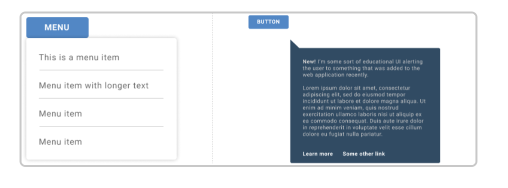

# Bosch B2B Portal extranet survey

### Remarks:
- Bosch B2B is a survey for feedback and ratings from customers.

[Live link](https://boschpt.eu.qualtrics.com/survey-builder/SV_8pNwEgkGotM9L5I/edit)

[qualtrics link](https://boschpt.eu.qualtrics.com/survey-builder/SV_8pNwEgkGotM9L5I/edit?organizationSSOConfigId=OSC_6gPzpHdURMquuY5&stateID=33d83bfa-e702-4f8d-9695-6fe0b3c2c1c7)

[Jira link](https://skopos-group.atlassian.net/jira/software/c/projects/BC/boards/72)

## **Install :**
- [npm install --save-dev webpack]()

- [npm i less]()

- [npm i less-loader]()

- [npm i nodemon]()

- [npm i webpack-cli]()